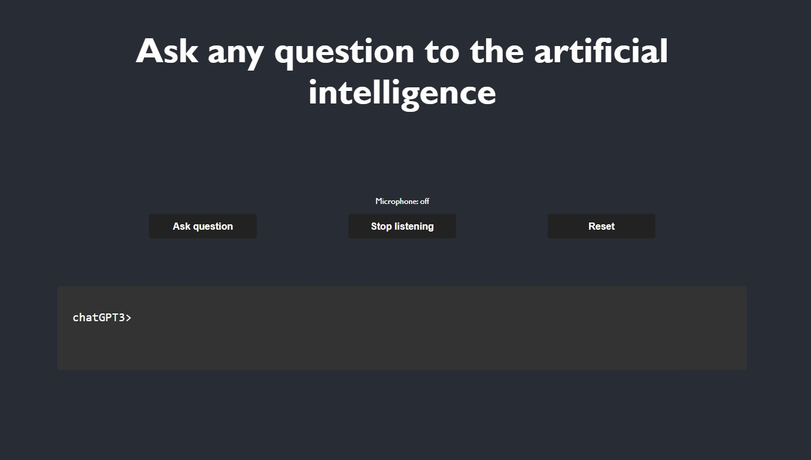

# Open Ai voice chat #

## About ##
This is a simple website build with React that takes a users voice input and generates a respond from one of the current active Open Ai models. It then takes this respons and turns the text to speech so you can finaly have that conversation with an advanced Ai you always wanted.

## instalation ##
Clone te repo and enter your personal api key inside the src/Microphone/Microphone.js file, and  run `npm install` and `npm start`.

You can also change the Open Ai model and the max tokens in the fetch function inside the Microphone.js file.

### Disclaimer ###
Do not host this page on the internet, this react app was not made to hide your api key. If you do host it, expect your keys to be stolen and used.